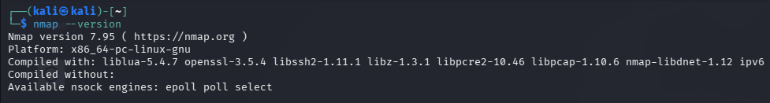
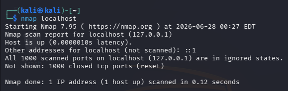
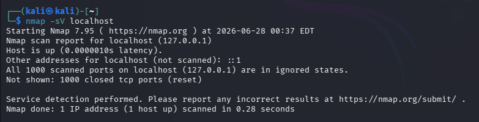

#Part a : install nmap 

#Part B: scan your local machine 
 

Total Open Ports: 0 
Port Numbers: None 
Services Running: No services were detected because all 1000 scanned TCP ports were closed.

#Part c: service version detection 
Port Number	Service Name	Version Detected
None	None	None

| Port Number | Service Name | Version Detected |
|-------------|--------------|------------------|
| None | None | None |

The Nmap scan did not detect any open TCP ports on the localhost. Since all 1000 scanned ports were closed, no network services were running on the scanned ports. As a result, Nmap could not identify any service names or software versions.

#Part D: Operating system detection 
1. Was the operating system detected?
Answer: No. The Nmap output does not show any operating system detection results.

2. Which OS was identified?
Answer: None. No operating system was identified because the scan did not produce any OS detection information.

3. Why is OS detection useful during penetration testing?
Answer:
Operating system detection helps penetration testers identify the target's operating system, such as Linux, Windows, or macOS. Knowing the operating system allows security professionals to understand the target environment, identify operating system–specific vulnerabilities, choose appropriate security testing techniques, and recommend relevant security patches and configurations.

#Part E: Common port research 
Common Network Ports and Security Risks

Port	Protocol	Purpose	Common Security Risks
20/21	FTP (File Transfer Protocol)	Used to transfer files between a client and a server. Port 20 is for data transfer, and Port 21 is for control commands.	FTP sends data and passwords in plain text, making it vulnerable to eavesdropping, credential theft, and brute-force attacks.
22	SSH (Secure Shell)	Provides secure remote login and encrypted communication between systems.	Weak passwords, brute-force attacks, and outdated SSH software can lead to unauthorized access.
23	Telnet	Allows remote access to devices and servers.	Telnet transmits all data, including passwords, in plain text, making it highly vulnerable to interception.
25	SMTP (Simple Mail Transfer Protocol)	Used for sending emails between mail servers and email clients.	Can be abused for spam, email spoofing, and phishing if not properly secured.
53	DNS (Domain Name System)	Translates domain names into IP addresses so users can access websites.	Vulnerable to DNS spoofing, cache poisoning, and amplification attacks.
80	HTTP (Hypertext Transfer Protocol)	Used to transfer web pages over the Internet without encryption.	Data can be intercepted through man-in-the-middle attacks because communication is not encrypted.
110	POP3 (Post Office Protocol v3)	Allows email clients to download emails from a mail server.	Without encryption, usernames, passwords, and emails can be intercepted.
143	IMAP (Internet Message Access Protocol)	Allows users to access and manage emails directly on the mail server.	Unencrypted IMAP connections may expose login credentials and email contents.
443	HTTPS (Hypertext Transfer Protocol Secure)	Provides secure communication between web browsers and web servers using SSL/TLS encryption.	Weak SSL/TLS configurations, expired certificates, or implementation flaws can reduce security.
445	SMB (Server Message Block)	Used for file and printer sharing on Windows networks.	Frequently targeted by malware and ransomware, including attacks like WannaCry.
3389	RDP (Remote Desktop Protocol)	Allows users to remotely access and control Windows computers.	Vulnerable to brute-force attacks, credential theft, and unauthorized remote access if not properly secured.

Conclusion
Network ports enable communication between computers and services. While each port serves a specific purpose, improperly secured services can expose systems to cyber threats. Organizations should close unused ports, apply security updates, use strong authentication, encrypt communications where possible, and continuously monitor network activity to reduce security risks.

#Part F: Scan analysis

Analysis of Nmap Scan Results

1. Which services are currently running?
Based on the Nmap scan results, no network services were detected. All 1000 scanned TCP ports were closed, which means there were no services listening for incoming network connections at the time of the scan.

2. Are all open ports necessary?
No open ports were found during the scan. In general, only the ports required for the system's intended purpose should remain open. Unnecessary open ports increase the system's attack surface and may expose it to security threats.

3. Which services could become security risks if misconfigured?
Services such as FTP (Port 21), Telnet (Port 23), SSH (Port 22), SMB (Port 445), and RDP (Port 3389) can become security risks if they are misconfigured. Weak passwords, outdated software, or incorrect security settings may allow attackers to gain unauthorized access or exploit known vulnerabilities.

4. Which port would you disable if it wasn't required?
If it were not required, I would disable Telnet (Port 23) because it transmits usernames and passwords in plain text, making it vulnerable to interception. A more secure alternative is SSH (Port 22), which encrypts all communication between the client and the server.

Conclusion
The scan showed that no network services were running on the scanned ports, which reduces the risk of network-based attacks. Keeping only essential services enabled and disabling unnecessary ports is an important security practice because it minimizes the attack surface and improves overall system security.

#Part G: Scan Report 
Nmap Scanning Report
Scan Date
28 June 2026
Target System
•	Host: localhost (127.0.0.1)
•	Operating Environment: Kali Linux

Commands Used
The following Nmap commands were used during the scanning phase:
nmap localhost
nmap -sV localhost
nmap -O localhost
These commands were used to identify open ports, detect running services, determine service versions, and attempt operating system detection.

Open Ports
Port Number	Status
None	All scanned ports were closed
Total Open Ports: 0

Running Services
Port	Service	Version
None	No services detected	Not Applicable
No active network services were identified because all scanned TCP ports were closed.

Operating System
Item	Result
Operating System Detected	No
OS Identified	None
The scan did not identify the operating system because there were no open ports available for OS fingerprinting.

Observations
•	The target host was reachable and responded to network requests.
•	All 1000 default TCP ports scanned by Nmap were closed.
•	No active network services were detected.
•	No service versions could be identified.
•	Operating system detection was unsuccessful due to the lack of open ports.

Recommendations
1.	Enable only the network services that are required for system operation.
2.	Disable unnecessary services and close unused ports to reduce the attack surface.
3.	Regularly update the operating system and installed applications with security patches.
4.	Configure a firewall to allow only trusted traffic.
5.	Perform periodic network scans to identify unexpected changes in open ports or running services.
6.	Use strong authentication methods for any services that are enabled.
7.	Continuously monitor system logs and network activity for suspicious behavior.

Conclusion
The scanning phase provided valuable insight into how Nmap can be used to assess the security posture of a system. During the scan, the target host was successfully identified as reachable, but no open TCP ports or active network services were found. As a result, Nmap was unable to detect the operating system or identify service versions. This exercise demonstrated that systems with no unnecessary network services exposed have a smaller attack surface and are generally less vulnerable to network-based attacks. I also learned the importance of port scanning in identifying active services, verifying security configurations, and supporting vulnerability assessments. Regular scanning helps administrators detect unauthorized services, confirm that only required ports are open, and improve overall network security. The scanning phase is an essential step in penetration testing because it provides valuable information that can be used to strengthen system security while ensuring that testing is performed in an ethical and authorized manner.
